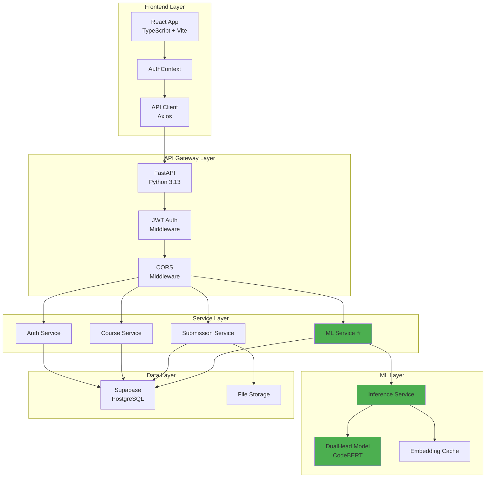
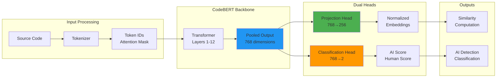
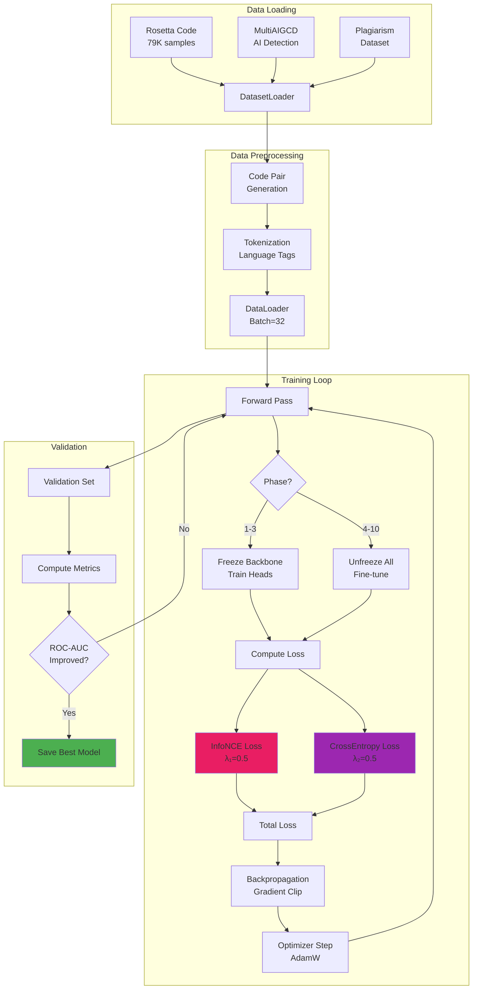
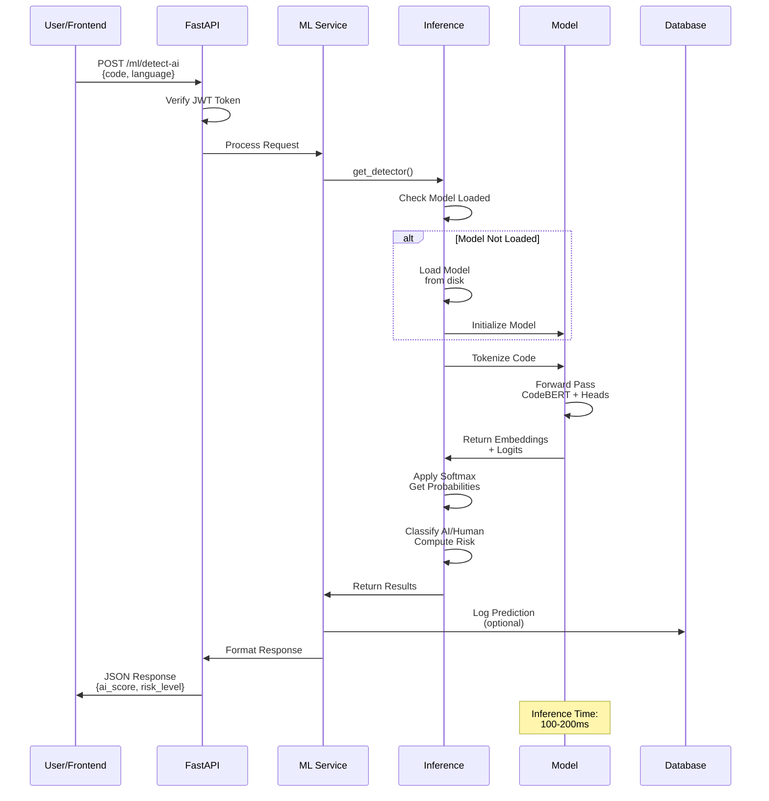
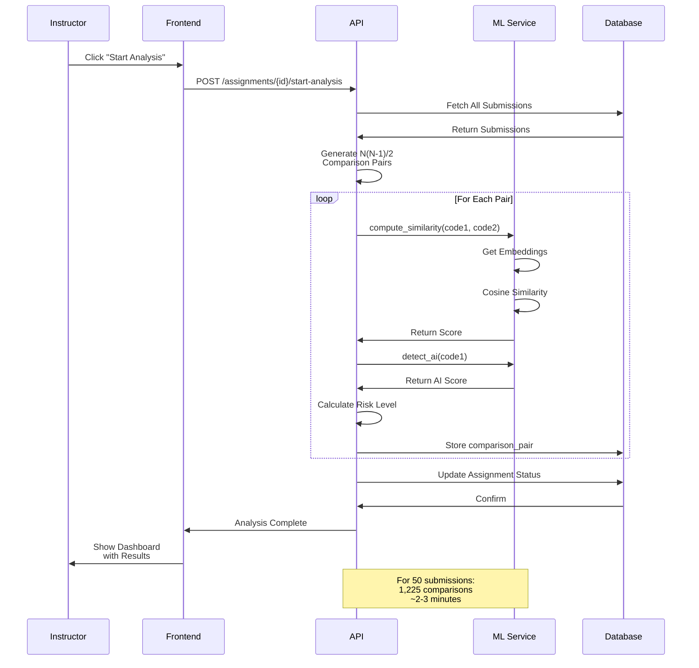
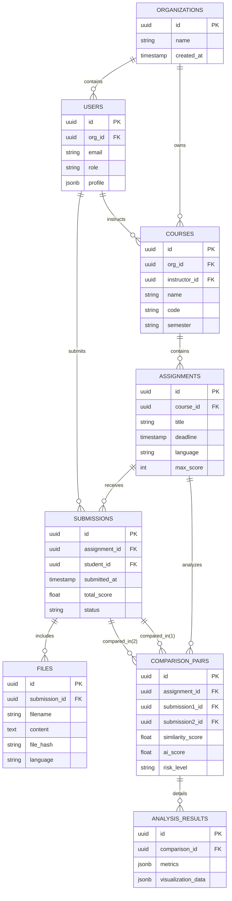
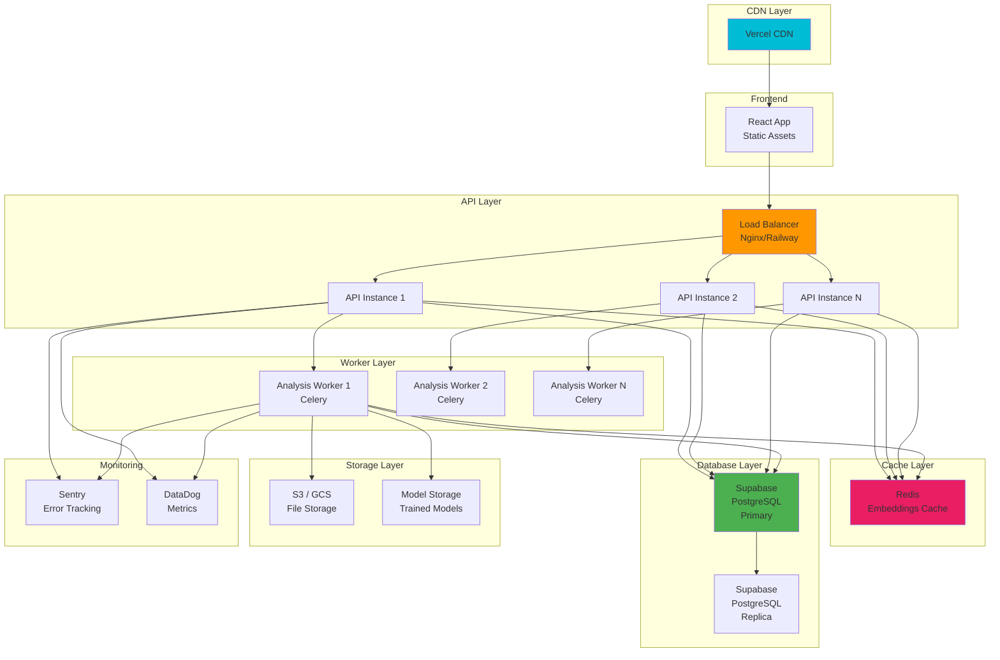
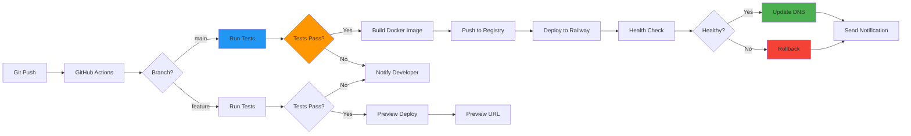
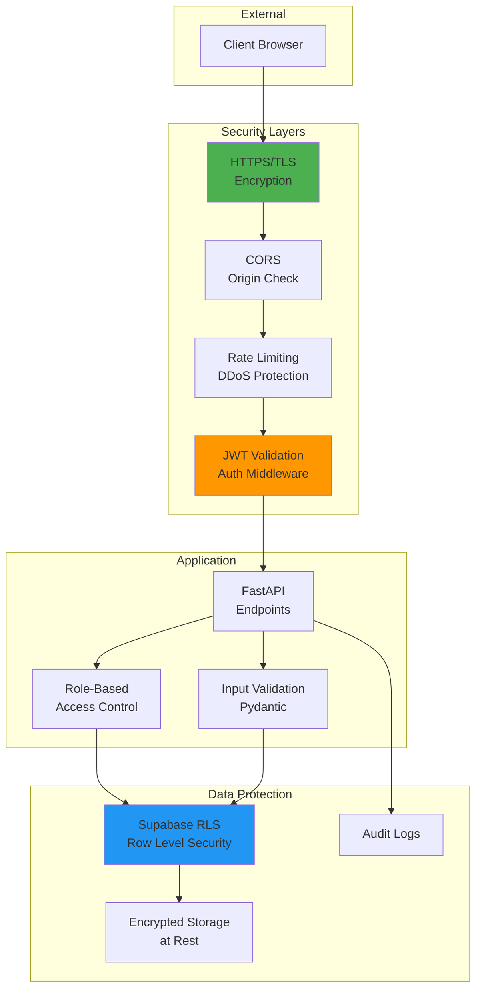
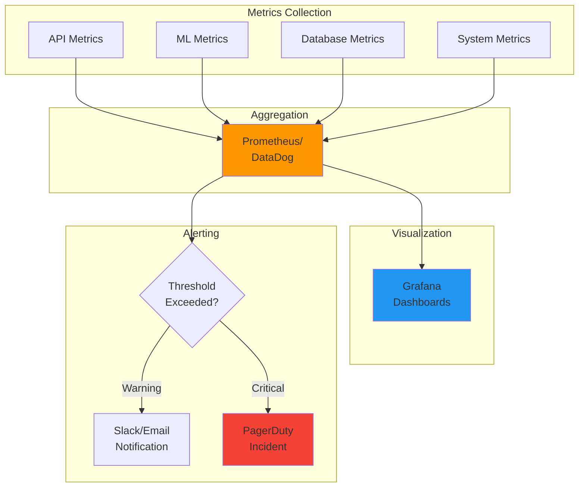

# System Architecture Diagrams

## High-Level Architecture

## ML Model Architecture

## Training Pipeline

## Request Flow - AI Detection

## Request Flow - Similarity Analysis

## Database Schema

## Deployment Architecture (Production)

## CI/CD Pipeline

## Security Architecture

## Monitoring Dashboard

---

## Legend

- 🟢 Production Ready
- 🟡 In Development
- 🟠 Planned
- 🔴 Critical Path
- ⭐ Core Feature

## Notes

All diagrams are generated using Mermaid and can be viewed in:
- GitHub (native support)
- VS Code (with Mermaid extension)
- Documentation sites (GitBook, MkDocs)

To edit diagrams, modify the Mermaid syntax in this file.
