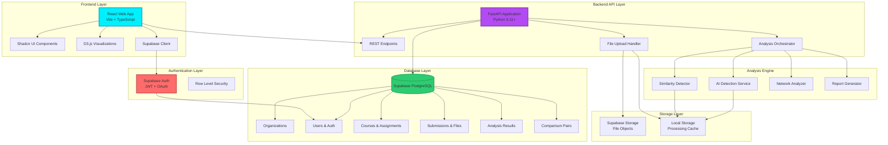
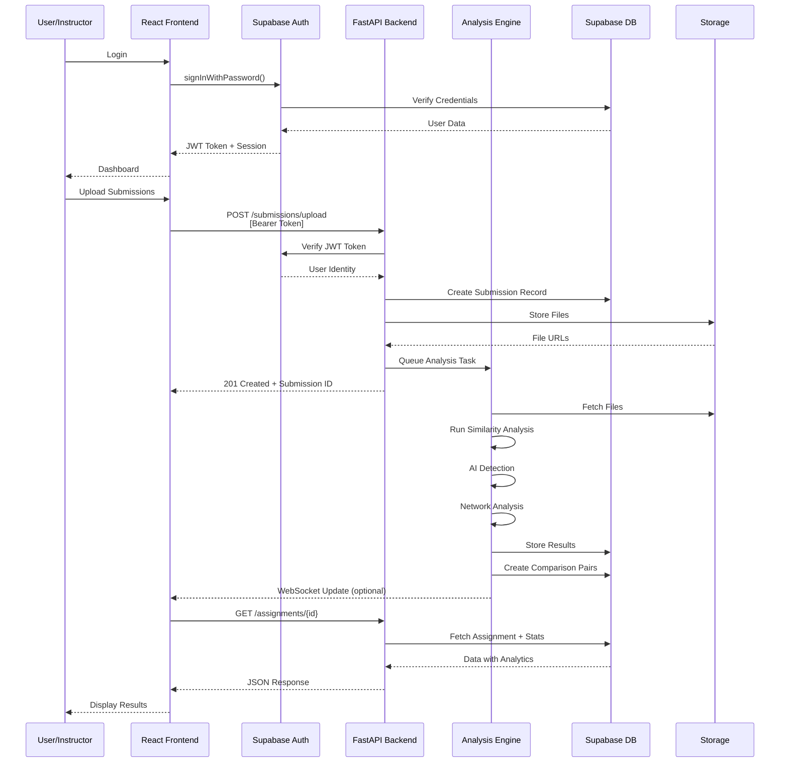
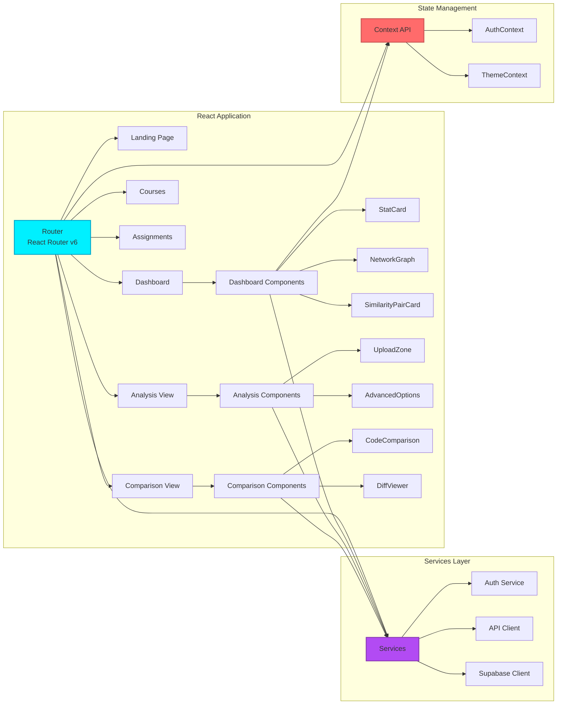
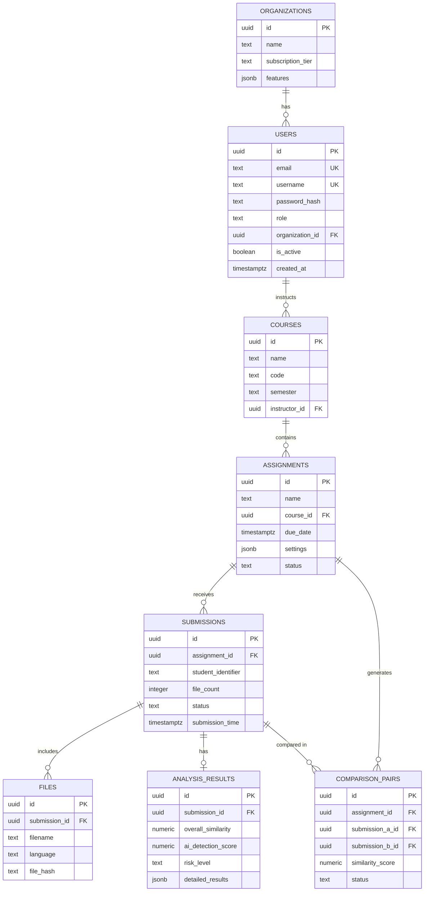

# CodeGuard Nexus 🛡️

<div align="center">


**Enterprise-Grade Academic Integrity Platform with AI Detection**

[](https://www.typescriptlang.org/)
[](https://reactjs.org/)
[](https://fastapi.tiangolo.com/)
[](https://supabase.com/)
[](https://www.python.org/)
[](LICENSE)

[Features](#-features) • [Architecture](#-system-architecture) • [Installation](#-installation) • [API](#-api-documentation) • [Database](#-database-schema)

</div>

---

## 📋 Table of Contents

- [Overview](#-overview)
- [System Architecture](#-system-architecture)
- [Technology Stack](#-technology-stack)
- [Database Schema](#-database-schema)
- [Features](#-features)
- [Installation](#-installation)
- [Configuration](#-configuration)
- [API Documentation](#-api-documentation)
- [Development](#-development)
- [Deployment](#-deployment)
- [Security](#-security)

---

## 🎯 Overview

**CodeGuard Nexus** is a professional-grade plagiarism detection and code similarity analysis platform designed for academic institutions. It combines advanced algorithms, machine learning models, and network graph analysis to provide educators with comprehensive insights into code submissions, collaboration patterns, and academic integrity violations.

### Key Capabilities

- 🔍 **Multi-Algorithm Detection**: AST analysis, token-based comparison, and ML models
- 🤖 **AI Code Detection**: Identifies ChatGPT, GitHub Copilot, and LLM-generated code
- 📊 **Network Visualization**: Interactive D3.js graphs showing collaboration patterns
- ⚡ **High Performance**: Process 1000+ submissions with optimized algorithms
- 🔐 **Enterprise Security**: Supabase backend with RLS and JWT authentication
- 🎨 **Modern UI/UX**: React + TailwindCSS with shadcn/ui components
- 🎓 **Google Classroom Integration**: Import courses and assignments directly from Google Classroom

---

## 🏗️ System Architecture

### High-Level Architecture



### Request Flow Architecture



### Component Architecture



---

## 🗄️ Database Schema

### Entity Relationship Diagram



### Table Descriptions

#### Organizations
Stores institution/organization data with subscription tiers and feature flags.

#### Users
User accounts with role-based access control (admin, instructor, student). Integrates with Supabase Auth.

#### Courses
Course information managed by instructors. Links to assignments and student rosters.

#### Assignments
Programming assignments with configurable analysis settings and due dates.

#### Submissions
Student code submissions with file tracking and processing status.

#### Files
Individual code files within submissions, with language detection and hash for deduplication.

#### Analysis Results
Comprehensive analysis results including similarity scores, AI detection, and risk levels.

#### Comparison Pairs
Pairwise similarity comparisons between submissions within an assignment.

---

## 🛠️ Technology Stack

### Frontend
- **Framework**: React 18 with TypeScript
- **Build Tool**: Vite
- **Styling**: TailwindCSS + shadcn/ui
- **State Management**: React Context API
- **Routing**: React Router v6
- **Data Visualization**: D3.js, Recharts
- **HTTP Client**: Axios
- **Authentication**: Supabase Auth Client

### Backend
- **Framework**: FastAPI (Python 3.11+)
- **Authentication**: JWT + Supabase Auth
- **Database**: Supabase (PostgreSQL 15)
- **ORM**: Supabase Python Client
- **File Storage**: Supabase Storage
- **Validation**: Pydantic v2
- **CORS**: FastAPI CORS Middleware

### Analysis Engine
- **Language Detection**: Pygments
- **Code Parsing**: tree-sitter
- **Similarity**: NLTK, scikit-learn
- **AI Detection**: GPT-detector models
- **Network Analysis**: NetworkX
- **Report Generation**: ReportLab (PDF)

### DevOps & Infrastructure
- **Version Control**: Git + GitHub
- **CI/CD**: GitHub Actions
- **Containerization**: Docker + Docker Compose
- **Monitoring**: Sentry (Error Tracking)
- **Logging**: Python logging + Supabase Logs

---

## 🚀 Features

### For Instructors

#### 📊 Dashboard Analytics
- Real-time submission statistics
- High-risk case alerts
- Recent activity timeline
- Course performance metrics

#### 📚 Course Management
- Create and organize courses
- Multi-semester support
- Assignment templates
- Student roster management
- **🎓 Google Classroom Import**: One-click course and assignment import

#### 🔍 Assignment Analysis
- Drag-and-drop file upload
- Bulk submission processing
- Configurable similarity thresholds
- Language-specific analysis (10+ languages)

#### 🎯 Detection Features
- **Code Similarity**: Multi-algorithm comparison (lexical, syntactic, semantic)
- **AI Detection**: Identify ChatGPT, Copilot-generated code
- **Network Graph**: Visualize copying patterns and collaboration
- **Side-by-Side Comparison**: Highlighted diff view with match scores

#### 📈 Reporting
- Comprehensive PDF reports
- CSV export for further analysis
- Evidence packages for integrity committees
- Configurable report templates

### For Administrators

#### 🏢 Organization Management
- Multi-tenant architecture
- Role-based access control
- Usage analytics
- Subscription tier management

#### 🔐 Security & Compliance
- Row-level security (RLS)
- JWT authentication
- Encrypted data at rest
- Audit logging

---

## 📦 Installation

### Prerequisites

- **Node.js**: v18+ and npm/bun
- **Python**: 3.11+
- **Supabase Account**: Free tier available
- **Git**: For version control

### Frontend Setup

```bash
# Clone the repository
git clone https://github.com/yourusername/code-guard-nexus.git
cd code-guard-nexus

# Install dependencies
npm install
# or
bun install

# Configure environment variables
cp .env.example .env
# Edit .env with your Supabase credentials

# Start development server
npm run dev
# or
bun dev
```

### Backend Setup

```bash
# Navigate to backend directory
cd backend

# Create virtual environment
python -m venv venv
source venv/bin/activate  # On Windows: venv\Scripts\activate

# Install dependencies
pip install -r requirements.txt

# Configure environment variables
cp .env.example .env
# Edit .env with your Supabase credentials

# Run development server
uvicorn app.main:app --reload
```

### Database Setup

1. **Create Supabase Project**
   - Go to [supabase.com](https://supabase.com)
   - Create a new project
   - Copy your project URL and anon key

2. **Run Database Migrations**
   ```sql
   -- Execute the SQL schema provided in database/schema.sql
   -- Or use Supabase SQL Editor
   ```

3. **Configure Row Level Security (RLS)**
   ```sql
   -- Enable RLS on all tables
   ALTER TABLE users ENABLE ROW LEVEL SECURITY;
   ALTER TABLE courses ENABLE ROW LEVEL SECURITY;
   -- ... (for all tables)
   
   -- Create policies (see database/policies.sql)
   ```

---

## 🎓 Google Classroom Integration

CodeGuard Nexus seamlessly integrates with Google Classroom to streamline your workflow.

### Features
- ✅ OAuth 2.0 secure authentication
- ✅ Import courses with one click
- ✅ Import assignments automatically
- ✅ View student rosters
- ✅ Sync status tracking
- ✅ Automatic token refresh

### Quick Setup

1. **Create Google Cloud Project** and enable Google Classroom API
2. **Configure OAuth consent screen** with required scopes
3. **Download credentials** and place in `backend/client_secret.json`
4. **Run database migration**:
   ```bash
   psql $SUPABASE_DB_URL -f backend/database/migrations/google_classroom_integration.sql
   ```
5. **Update `.env`** file:
   ```env
   GOOGLE_CLIENT_SECRETS_FILE=client_secret.json
   GOOGLE_OAUTH_REDIRECT_URI=http://localhost:5173/auth/google/callback
   ```

📖 **Full Setup Guide**: See [GOOGLE_CLASSROOM_SETUP.md](./GOOGLE_CLASSROOM_SETUP.md) for detailed instructions.

---

## ⚙️ Configuration

### Frontend Environment Variables

```env
# .env
VITE_SUPABASE_URL=https://your-project.supabase.co
VITE_SUPABASE_ANON_KEY=your-anon-key
VITE_API_URL=http://localhost:8000/api/v1
```

### Backend Environment Variables

```env
# backend/.env
SUPABASE_URL=https://your-project.supabase.co
SUPABASE_KEY=your-anon-key
SUPABASE_SERVICE_KEY=your-service-role-key

API_V1_STR=/api/v1
PROJECT_NAME=CodeGuard Nexus API
DEBUG=True
ALLOWED_ORIGINS=http://localhost:5173,http://localhost:3000

SECRET_KEY=your-super-secret-key-change-in-production
ALGORITHM=HS256
ACCESS_TOKEN_EXPIRE_MINUTES=30
```

---

## 📚 API Documentation

### Authentication

#### Register
```http
POST /api/v1/auth/register
Content-Type: application/json

{
  "email": "instructor@university.edu",
  "username": "instructor",
  "password": "SecurePassword123!",
  "role": "instructor"
}
```

#### Login
```http
POST /api/v1/auth/login
Content-Type: application/json

{
  "email": "instructor@university.edu",
  "password": "SecurePassword123!"
}

Response:
{
  "access_token": "eyJhbGc....",
  "token_type": "bearer",
  "user": {
    "id": "uuid",
    "email": "instructor@university.edu",
    "role": "instructor"
  }
}
```

### Courses

#### List Courses
```http
GET /api/v1/courses
Authorization: Bearer {token}
```

#### Create Course
```http
POST /api/v1/courses
Authorization: Bearer {token}
Content-Type: application/json

{
  "name": "CS 101 - Introduction to Programming",
  "code": "CS101",
  "semester": "Fall 2024"
}
```

### Assignments

#### Create Assignment
```http
POST /api/v1/assignments
Authorization: Bearer {token}
Content-Type: application/json

{
  "name": "Assignment 1: Hello World",
  "course_id": "course-uuid",
  "due_date": "2024-02-15T23:59:59Z",
  "settings": {
    "similarity_threshold": 0.7,
    "enable_ai_detection": true
  },
  "status": "active"
}
```

#### Start Analysis
```http
POST /api/v1/assignments/{assignment_id}/start-analysis
Authorization: Bearer {token}

Response:
{
  "message": "Analysis started",
  "assignment_id": "uuid",
  "submission_count": 45,
  "comparison_pairs_created": 990
}
```

### Submissions

#### Upload Submissions
```http
POST /api/v1/submissions/upload
Authorization: Bearer {token}
Content-Type: multipart/form-data

assignment_id: uuid
student_identifier: student123
files: [File, File, ...]

Response:
{
  "submission_id": "uuid",
  "files_uploaded": 3,
  "files": [...]
}
```

#### List Submissions
```http
GET /api/v1/submissions?assignment_id={uuid}
Authorization: Bearer {token}
```

### Comparisons

#### Get High-Risk Comparisons
```http
GET /api/v1/comparisons/assignment/{assignment_id}/high-risk?threshold=0.7
Authorization: Bearer {token}

Response:
[
  {
    "id": "uuid",
    "assignment_id": "uuid",
    "submission_a_id": "uuid",
    "submission_b_id": "uuid",
    "similarity_score": 0.95,
    "status": "completed",
    "submission_a": {...},
    "submission_b": {...}
  }
]
```

### Dashboard

#### Get Statistics
```http
GET /api/v1/dashboard/stats
Authorization: Bearer {token}

Response:
{
  "total_assignments": 12,
  "total_submissions": 540,
  "pending_reviews": 23,
  "high_risk_cases": 8,
  "recent_activity": [...]
}
```

For complete API documentation, visit: `http://localhost:8000/api/v1/docs` (Swagger UI)

---

## 🔧 Development

### Project Structure

```
code-guard-nexus/
├── src/                      # Frontend source
│   ├── components/          # React components
│   │   ├── ui/             # shadcn/ui components
│   │   ├── dashboard/      # Dashboard components
│   │   ├── comparison/     # Code comparison
│   │   └── upload/         # File upload
│   ├── pages/              # Page components
│   ├── lib/                # Utilities & services
│   │   ├── supabase.ts    # Supabase client
│   │   ├── auth.ts        # Auth service
│   │   ├── api.ts         # API client
│   │   └── utils.ts       # Helpers
│   ├── contexts/           # React contexts
│   ├── hooks/              # Custom hooks
│   └── types/              # TypeScript types
├── backend/                 # Backend source
│   ├── app/
│   │   ├── api/            # API endpoints
│   │   │   ├── auth.py
│   │   │   ├── courses.py
│   │   │   ├── assignments.py
│   │   │   ├── submissions.py
│   │   │   ├── comparisons.py
│   │   │   └── dashboard.py
│   │   ├── core/           # Core configuration
│   │   │   ├── config.py
│   │   │   ├── database.py
│   │   │   └── security.py
│   │   ├── models/         # Data models
│   │   ├── schemas/        # Pydantic schemas
│   │   ├── services/       # Business logic
│   │   └── main.py         # App entry point
│   ├── requirements.txt
│   └── .env
├── public/                  # Static assets
├── package.json
├── tsconfig.json
├── vite.config.ts
└── README.md
```

### Running Tests

```bash
# Frontend tests
npm test

# Backend tests
cd backend
pytest
```

### Code Quality

```bash
# Frontend linting
npm run lint

# Backend linting
cd backend
flake8 app/
black app/
mypy app/
```

---

## 🚀 Deployment

### Frontend Deployment (Vercel)

```bash
# Install Vercel CLI
npm i -g vercel

# Deploy
vercel

# Production deployment
vercel --prod
```

### Backend Deployment (Railway/Render)

```bash
# Using Docker
docker build -t codeguard-api ./backend
docker run -p 8000:8000 codeguard-api

# Or using Railway
railway login
railway init
railway up
```

### Database (Supabase)

Supabase provides managed PostgreSQL hosting with automatic backups, scaling, and monitoring.

---

## 🔒 Security

### Authentication Flow

1. User registers/logs in via Supabase Auth
2. Frontend receives JWT access token
3. Token stored in memory (not localStorage for security)
4. Token sent with all API requests via Authorization header
5. Backend verifies token with Supabase
6. Row Level Security enforces data access rules

### Row Level Security Policies

```sql
-- Users can only view their own data
CREATE POLICY "Users can view own data"
ON users FOR SELECT
USING (auth.uid() = id);

-- Instructors can only manage their own courses
CREATE POLICY "Instructors manage own courses"
ON courses FOR ALL
USING (auth.uid() = instructor_id);

-- Students can only view assignments from their courses
CREATE POLICY "Students view course assignments"
ON assignments FOR SELECT
USING (
  course_id IN (
    SELECT course_id FROM enrollments
    WHERE user_id = auth.uid()
  )
);
```

### Best Practices

- ✅ Environment variables for secrets
- ✅ JWT token expiration (30 minutes)
- ✅ HTTPS only in production
- ✅ CORS configured for specific origins
- ✅ Rate limiting on API endpoints
- ✅ Input validation with Pydantic
- ✅ SQL injection prevention via ORM
- ✅ XSS protection in React
- ✅ CSRF tokens for state-changing operations

---

## 🤝 Contributing

We welcome contributions! Please see our [Contributing Guidelines](CONTRIBUTING.md).

### Development Workflow

1. Fork the repository
2. Create a feature branch (`git checkout -b feature/amazing-feature`)
3. Commit your changes (`git commit -m 'Add amazing feature'`)
4. Push to the branch (`git push origin feature/amazing-feature`)
5. Open a Pull Request

---

## 📄 License

This project is licensed under the MIT License - see the [LICENSE](LICENSE) file for details.

---

## 🙏 Acknowledgments

- Built with [FastAPI](https://fastapi.tiangolo.com/)
- Powered by [Supabase](https://supabase.com/)
- UI components from [shadcn/ui](https://ui.shadcn.com/)
- Icons from [Lucide](https://lucide.dev/)

---

<div align="center">

**Made with ❤️ for Educators**

[Report Bug](https://github.com/yourusername/code-guard-nexus/issues) • [Request Feature](https://github.com/yourusername/code-guard-nexus/issues)

</div>
