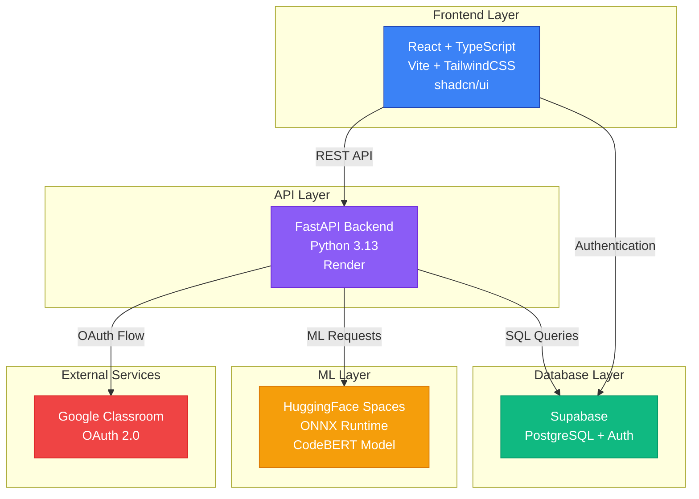
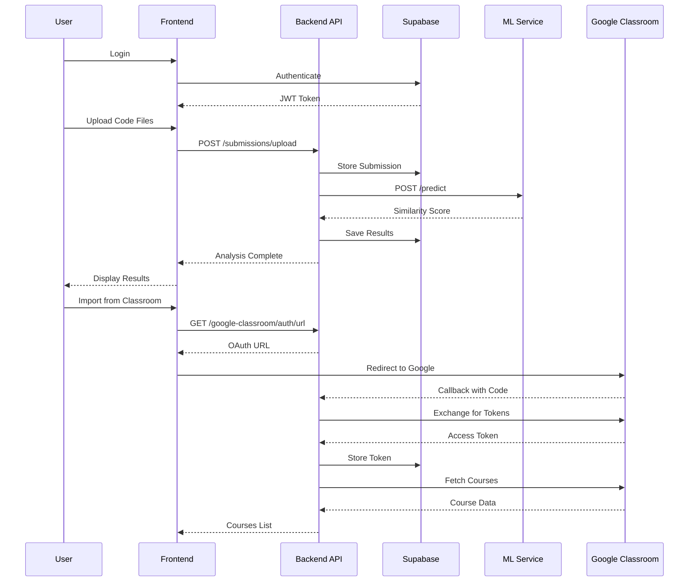
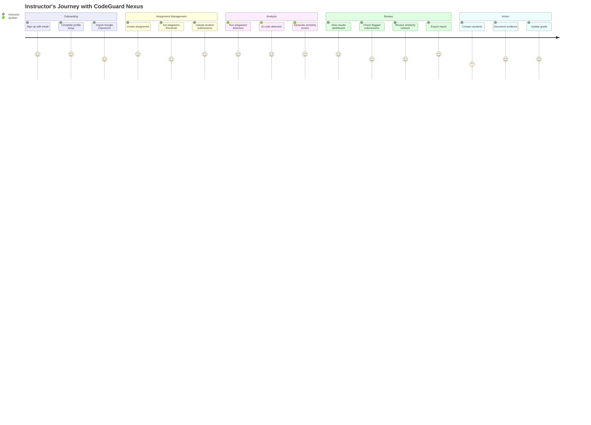
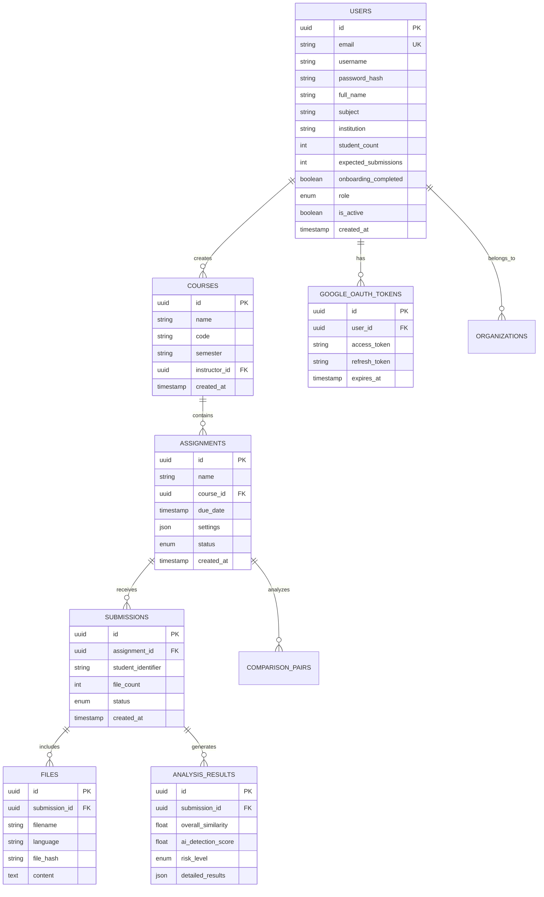
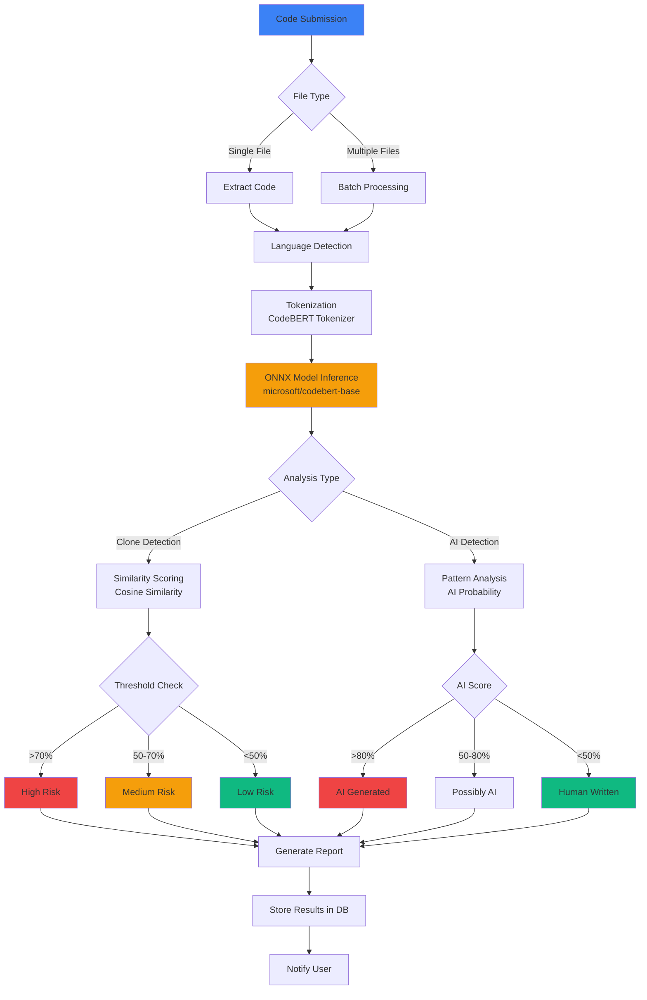
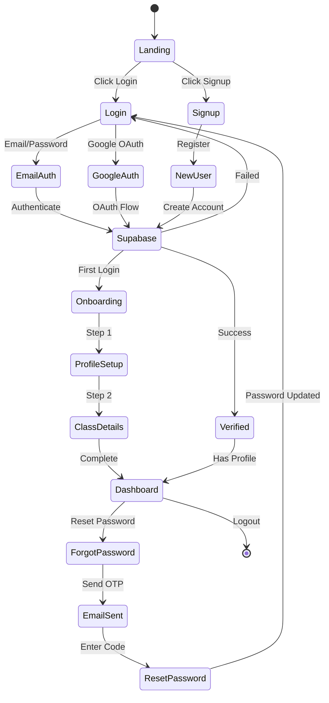

# CodeGuard Nexus 🛡️

> **AI-Powered Code Plagiarism Detection & Academic Integrity Platform**

CodeGuard Nexus is an advanced academic integrity monitoring system that helps educators detect plagiarism, AI-generated code, and maintain code quality standards using machine learning.

## ✨ Features

### 🔍 **Advanced Detection**
- **Code Plagiarism Detection**: Uses CodeBERT ML model with 96% accuracy (ONNX-optimized)
- **AI Code Detection**: Identifies AI-generated code submissions
- **Cross-Language Support**: Detects plagiarism across different programming languages
- **Auto Language Detection**: Automatically identifies programming languages from code and file extensions

### 📊 **Smart Analysis**
- **Batch Comparison**: Compare multiple submissions simultaneously
- **Similarity Scoring**: Detailed similarity percentages with risk level classification
- **Network Graph Visualization**: Visual representation of plagiarism clusters
- **Real-time Dashboard**: Live metrics and analytics

### 🎓 **Google Classroom Integration**
- **OAuth 2.0 Authentication**: Secure Google account integration
- **Course Import**: Import courses directly from Google Classroom
- **Assignment Sync**: Automatically fetch coursework and submissions
- **Student Management**: Seamless roster synchronization

### 👥 **User Experience**
- **Onboarding Flow**: Guided setup for new users
- **Profile Management**: Track student count, subject, and submission volume
- **History Tracking**: Complete audit trail of all scans
- **Dark/Light Mode**: Beautiful UI with theme support

### 🔐 **Authentication & Security**
- **Supabase Auth**: Secure authentication with email/password
- **Google OAuth**: Social login integration
- **Password Reset**: Forgot password feature with OTP verification
- **Role-Based Access**: Instructor, student, and admin roles

## 🏗️ Architecture



### System Flow



## 🚀 Quick Start

### Prerequisites
- Node.js 18+ and npm/bun
- Python 3.13+
- Supabase account
- Git

### Installation

1. **Clone the repository**
```bash
git clone https://github.com/Shafwansafi06/code-guard-nexus.git
cd code-guard-nexus
```

2. **Install frontend dependencies**
```bash
npm install
# or
bun install
```

3. **Install backend dependencies**
```bash
cd backend
python -m venv venv
source venv/bin/activate  # On Windows: venv\Scripts\activate
pip install -r requirements.txt
```

4. **Set up environment variables**

Create `backend/.env`:
```env
# Supabase
SUPABASE_URL=your_supabase_url
SUPABASE_KEY=your_anon_key
SUPABASE_SERVICE_KEY=your_service_role_key

# JWT
SECRET_KEY=your_secret_key_here

# Google OAuth (Optional)
GOOGLE_CLIENT_ID=your_client_id
GOOGLE_CLIENT_SECRET=your_client_secret
GOOGLE_OAUTH_REDIRECT_URI=https://your-backend-url/api/v1/google-classroom/auth/callback
FRONTEND_URL=https://your-frontend-url
```

Create `src/.env`:
```env
VITE_API_URL=http://localhost:8000/api/v1
VITE_SUPABASE_URL=your_supabase_url
VITE_SUPABASE_ANON_KEY=your_anon_key
```

5. **Run the database migration**
```bash
# Execute the SQL file in your Supabase SQL editor
cat backend/database/migrations/add_user_profile_fields.sql
```

6. **Start the development servers**

Backend:
```bash
cd backend
uvicorn app.main:app --reload --port 8000
```

Frontend:
```bash
npm run dev
# or
bun dev
```

Visit `http://localhost:5173`

## 🎯 User Journey



## 📦 Deployment

### Frontend (Vercel)
1. Connect your GitHub repository to Vercel
2. Set environment variables in Vercel dashboard
3. Deploy automatically on push to main

### Backend (Render)
1. Create new Web Service on Render
2. Connect GitHub repository
3. Set build command: `pip install -r requirements.txt`
4. Set start command: `uvicorn app.main:app --host 0.0.0.0 --port $PORT`
5. Add environment variables
6. Deploy

### ML API (HuggingFace Spaces)
Already deployed at: `https://shafwansafi06-code-clone-detector.hf.space`

## 🔧 Tech Stack

### Frontend
- **React 18** with TypeScript
- **Vite** for fast builds
- **TailwindCSS** for styling
- **shadcn/ui** component library
- **Framer Motion** for animations
- **Recharts** for data visualization
- **React Query** for data fetching

### Backend
- **FastAPI** 0.115.0
- **Python 3.13**
- **Supabase** (PostgreSQL + Auth)
- **Pydantic** for validation
- **Google APIs** for Classroom integration

### ML/AI
- **CodeBERT** (microsoft/codebert-base)
- **ONNX Runtime** 1.20.1 (2-3x faster inference)
- **Transformers** library
- **HuggingFace** for model hosting

## 📚 API Endpoints

### Authentication
- `POST /api/v1/auth/register` - Register new user
- `POST /api/v1/auth/login` - Login user
- `POST /api/v1/auth/forgot-password` - Send reset code
- `POST /api/v1/auth/reset-password` - Reset password with OTP
- `GET /api/v1/auth/me` - Get current user

### Profile
- `GET /api/v1/profile/me` - Get user profile
- `POST /api/v1/profile/setup` - Complete onboarding
- `PUT /api/v1/profile/update` - Update profile

### Courses
- `GET /api/v1/courses` - List courses
- `POST /api/v1/courses` - Create course
- `GET /api/v1/courses/{id}` - Get course details

### Assignments
- `GET /api/v1/assignments` - List assignments
- `POST /api/v1/assignments` - Create assignment
- `GET /api/v1/assignments/{id}/results` - Get results

### Submissions
- `POST /api/v1/submissions/upload` - Upload files
- `GET /api/v1/submissions/{id}` - Get submission

### ML Analysis
- `POST /api/v1/ml/detect-clone` - Detect code similarity
- `POST /api/v1/ml/detect-ai` - Detect AI-generated code
- `POST /api/v1/ml/batch-clone` - Batch comparison

### Google Classroom
- `GET /api/v1/google-classroom/auth/url` - Get OAuth URL
- `GET /api/v1/google-classroom/auth/callback` - OAuth callback
- `GET /api/v1/google-classroom/courses` - List courses
- `POST /api/v1/google-classroom/import-course` - Import course

## 🎨 Language Detection

Automatically detects **30+ programming languages** including:
- Python, JavaScript, TypeScript, Java, C++, C, C#
- PHP, Ruby, Go, Rust, Swift, Kotlin, Scala
- HTML, CSS, SQL, Shell, PowerShell
- JSON, YAML, Markdown, and more

## 📊 Database Schema



## 🔄 ML Detection Pipeline



## 🔐 Authentication Flow



## 🤝 Contributing

1. Fork the repository
2. Create your feature branch (`git checkout -b feature/AmazingFeature`)
3. Commit your changes (`git commit -m 'Add some AmazingFeature'`)
4. Push to the branch (`git push origin feature/AmazingFeature`)
5. Open a Pull Request

## 📝 License

This project is licensed under the MIT License.

## 👤 Author

**Shafwan Safi**
- GitHub: [@Shafwansafi06](https://github.com/Shafwansafi06)
- Email: shafwansafi06@gmail.com

## 🙏 Acknowledgments

- CodeBERT model by Microsoft
- shadcn/ui component library
- Supabase for backend infrastructure
- HuggingFace for ML model hosting
- FastAPI for backend framework

## 📧 Support

For support, email shafwansafi06@gmail.com or open an issue on GitHub.

---

Made with ❤️ by Shafwan Safi
